## All backdrops included here are from the NsCDE desktop or are a modifed version of a backdrop from NsCDE

## Building
Requirements:
- Bash
- GnuCoreUtils or uutils
- ffmpeg

Once requirements are met run build.sh

## Converting Backdrops
Backdrop images from CDE and NsCDE are originally in a moddifed version of [xpm3](https://en.wikipedia.org/wiki/X_PixMap#XPM3) (.pm) and need to be modifed for ffmpeg to read them. 
To make them readable and convert to catppuccin colors: (if you need a reference check files in the xpm directory in this repo)
1. download this repo either via git or direct download
2. change file extention to .xpm (if you stop at this point it becomes viewable in the gwenview image viewer)
3. remove all comments exept the one contataining XPM at the begining of the file
4. replace `s` placed before the system colors and hex color with the letter `c`
5. remove all text inbetween the `c` you just placed and the `",` at the end of the line
6. add `{{<color>.hex}}`(use a catppuccin color name ie; surface0, base, green etc instead of `<color>`) inbetween `c` and `",`
7. save your file changes and move the file to the `xpm` directory in yuor local copy of hte git repo
8. run `build.sh` to color the image files
9. repeat steps 6 and 8 until happy with image results

## Previews

 Afternoon 

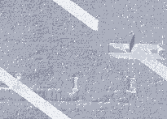
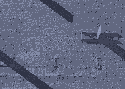
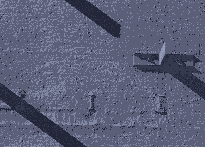
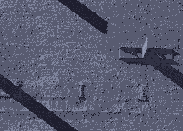

 Ankh 

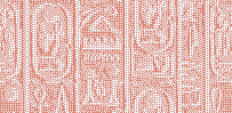
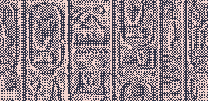
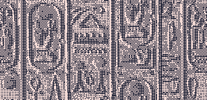
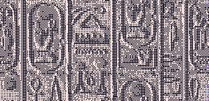

 Arabesca Dark 

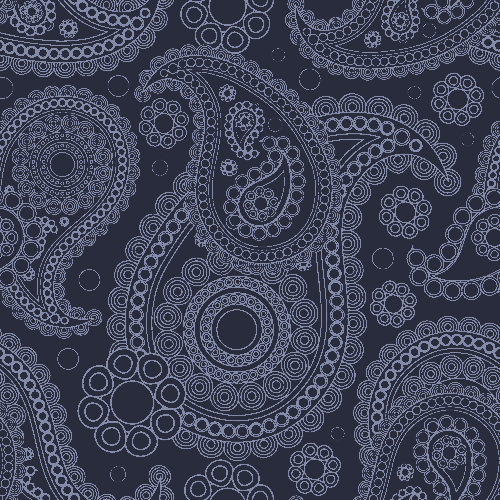
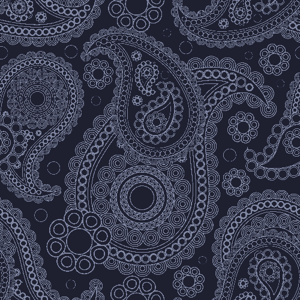
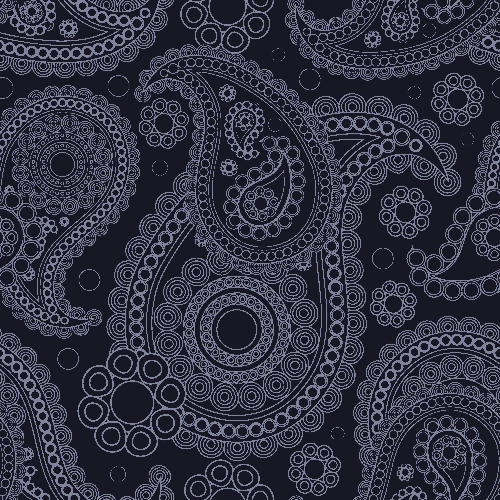

 Arabesca Light 

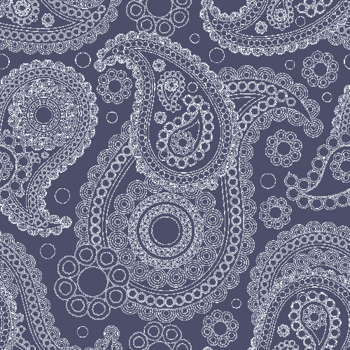
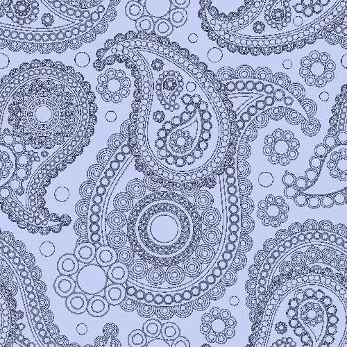
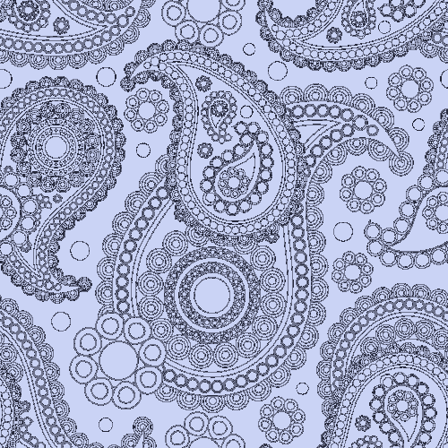
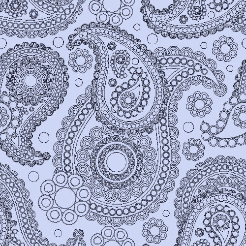

 Arabian Mosaic 

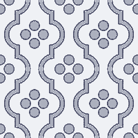
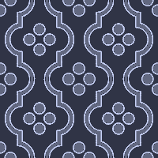
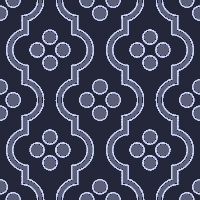
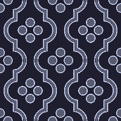

 Armor 

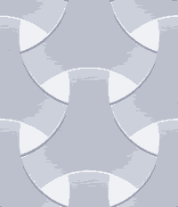
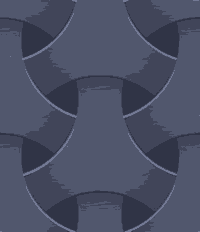
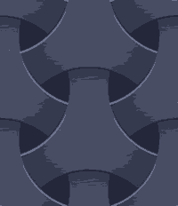
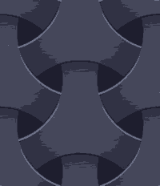

 Asanoha 

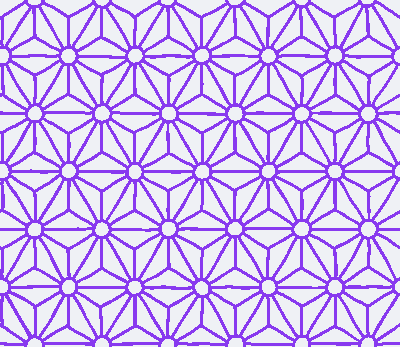
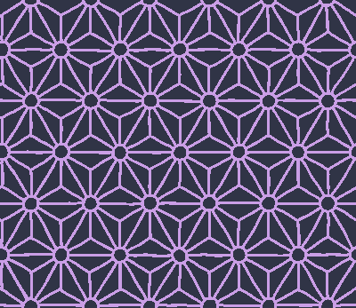
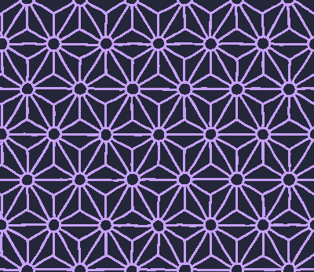
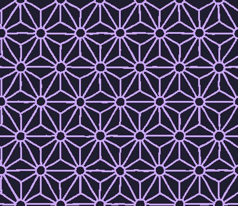

 Brick Wall 

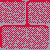

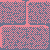
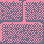

 Carps 

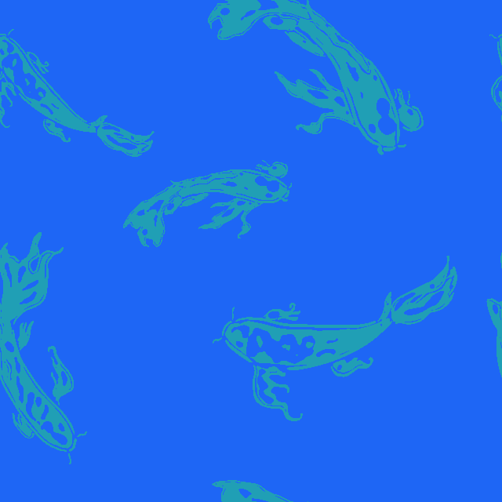
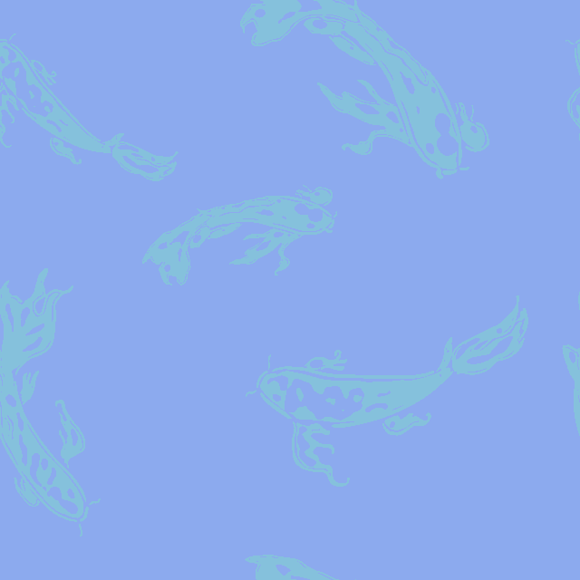

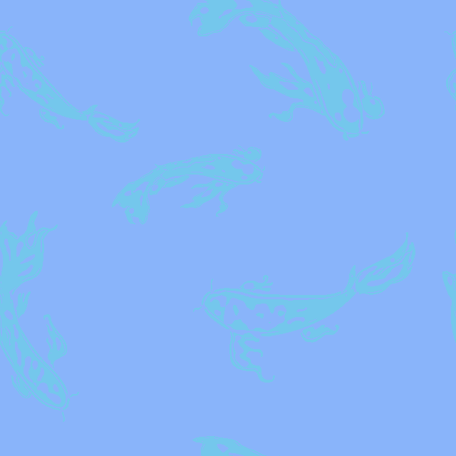

 Circuit Boards 

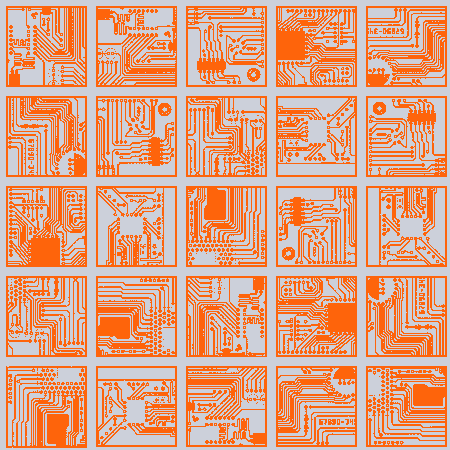
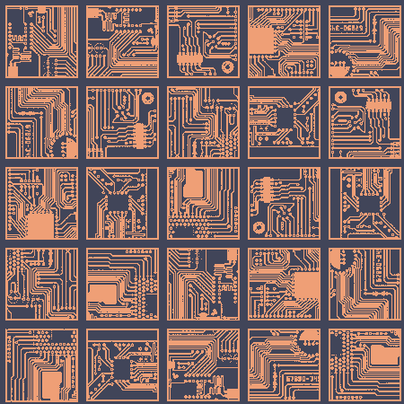

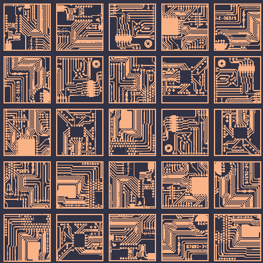

 Coffee Leaves Alt 

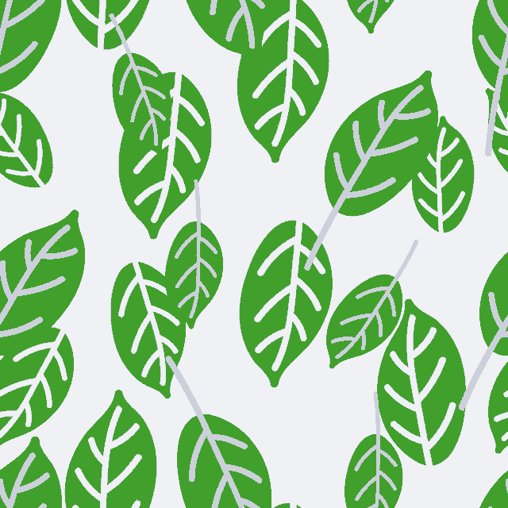

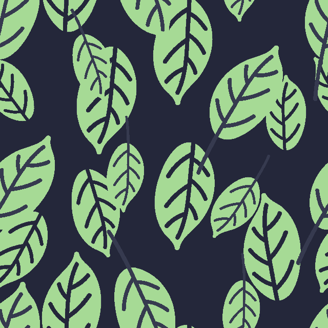
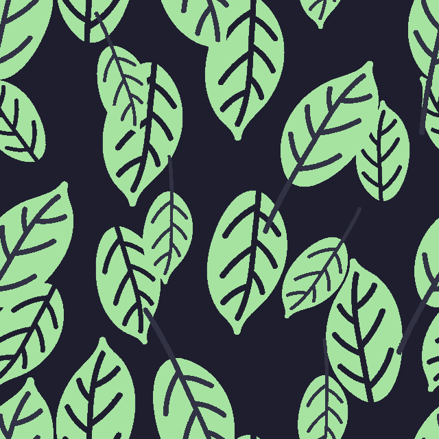

 Coffee Leaves 

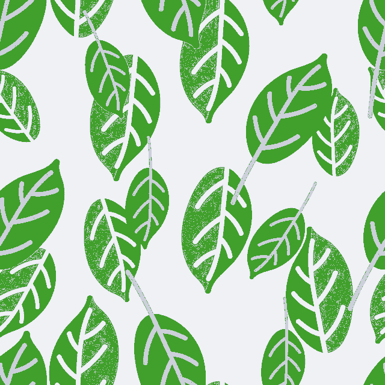

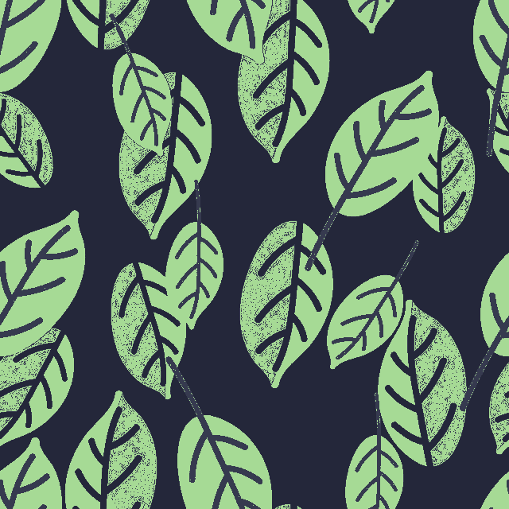
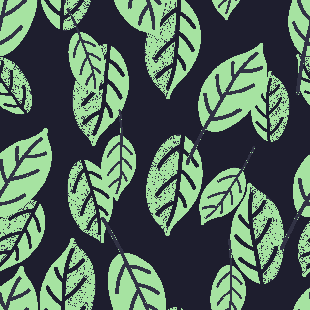

 FvwmBg1 

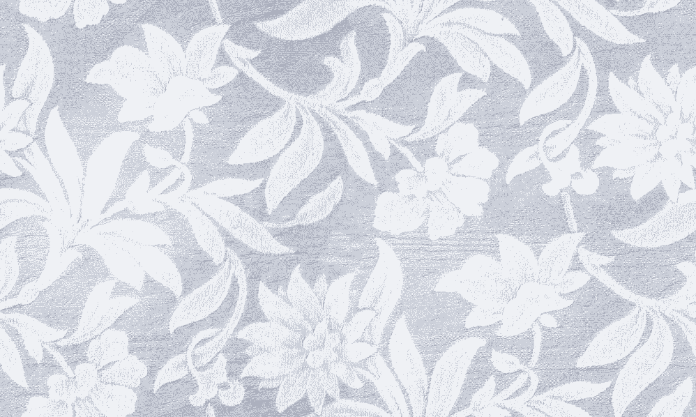
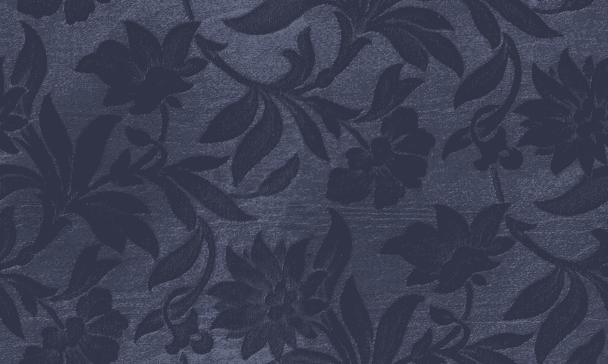
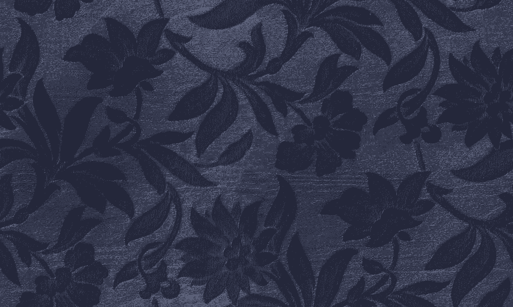

 FvwmBg2 

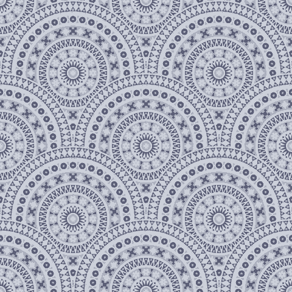

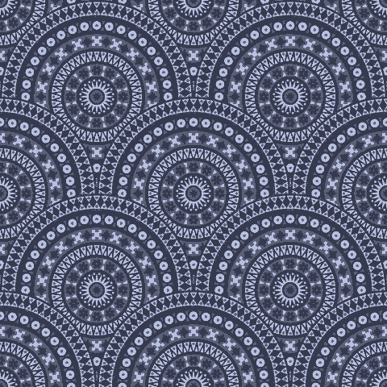
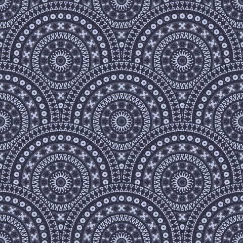

 Heating 

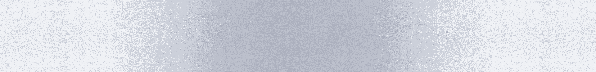
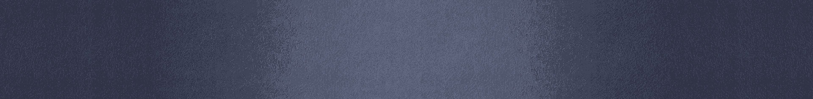

 Jungle 

 Memphis 

 Small Flowers 

 Space 

 Sun Logo Base 

 Sun Logo Blue 

 Sun Logo Red 

 Sun Logo Text 

 Tartan 

 Toronto 

